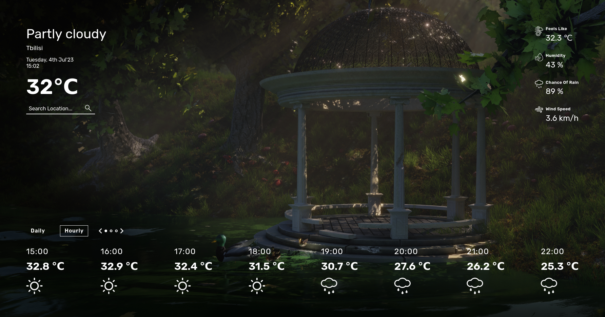

# WeatherO

# Odin Project - weather app challange

This is a solution to Odin Projects weather-app challange

## Table of contents

- [Overview](#overview)
  - [Screenshot](#screenshot)
  - [Links](#links)
- [What I've learned](#Learned)
- [Author](#author)

## Overview

This is a simple weather app, displays current tempreture, location and some extra info, also weekly and hourly weather info with toggle between functionality.

### Screenshot

### Links

[Click to view live site](https://gwynbleidd0014.github.io/Weather-app/)

## Learned

I've practiced working with api, it was fun. More dom manipulation and yes it's responsive.

## Author

Hello, I'm Ucha, you might know me as [gwynbleidd0014](https://github.com/gwynbleidd0014) on github
